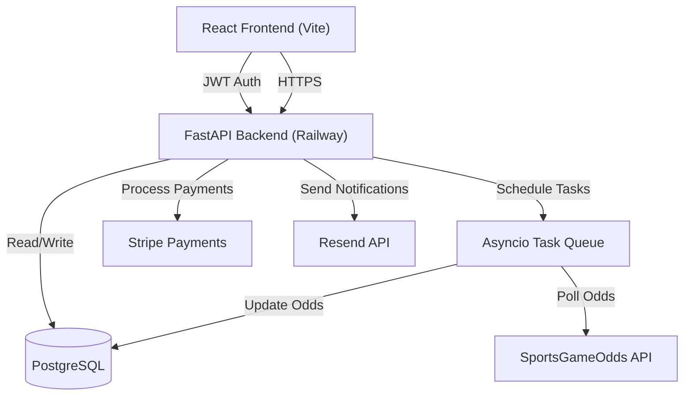

# 🎥 [Watch the Live Demo (1 min)](https://www.loom.com/share/bd4fb07ca8994541a428737aa70fa492)

# Arbify - Professional Arbitrage Betting Platform

**A modern SaaS platform that automates sports arbitrage betting opportunities with real-time odds scanning, smart calculators, and subscription-based premium features.**

---

## Project Overview

Arbify is a sophisticated web application that helps users identify and capitalize on sports arbitrage betting opportunities. The platform scans multiple sportsbooks in real-time, calculates optimal stake distributions, and provides professional tools for guaranteed profit betting strategies.

### Key Value Propositions:
- **Guaranteed Profits**: Mathematical arbitrage ensures profit regardless of game outcomes
- **Real-time Scanning**: Automated odds monitoring across multiple bookmakers
- **Professional Tools**: Advanced calculators, strategy management, and performance tracking
- **Simple Pricing**: All-inclusive subscription model

---

## System Architecture

---

## Tech Stack

### Frontend
- **React 18** - Modern component-based UI framework
- **Vite** - Fast build tool and development server
- **Tailwind CSS** - Utility-first styling framework
- **React Router** - Client-side navigation
- **Axios** - HTTP client for API communication
- **React Context** - State management for authentication

### Backend
- **Python 3.9+** - Core backend language
- **FastAPI** - High-performance async web framework
- **SQLAlchemy** - Python SQL toolkit and ORM
- **SQLite** - Development database
- **Alembic** - Database migration management
- **JWT** - Secure token-based authentication
- **bcrypt** - Password hashing and security

### Third-Party Services
- **Stripe** - Payment processing and subscription management
- **SportsGameOdds API** - Real-time sports betting odds data
- **Railway** - Backend hosting and database
- **Vercel** - Frontend hosting and CDN

### Development Tools
- **ESLint** - JavaScript linting
- **PostCSS** - CSS processing
- **Git** - Version control

---

## Features

### Core Functionality
- **Arbitrage Finder**: Real-time scanning for profitable betting opportunities
- **Smart Calculator**: Optimal stake distribution calculations
- **Odds Comparison**: Multi-bookmaker odds analysis
- **Strategy Management**: Custom arbitrage strategy creation and tracking

### User Management
- **Secure Authentication**: JWT-based login/registration system
- **Email Verification**: Account verification and password reset
- **Profile Management**: User preferences and account settings
- **Subscription Tracking**: Plan management and billing integration

### Subscription Tiers

#### Pro Plan ($39.99/month)
- Unlimited arbitrage opportunities (Pre-match & Live)
- Advanced calculator & stake sizing
- Unlimited custom strategies
- Real-time browser alerts
- High-speed odds refresh (30 seconds)
- Automated opportunity tracking

---

